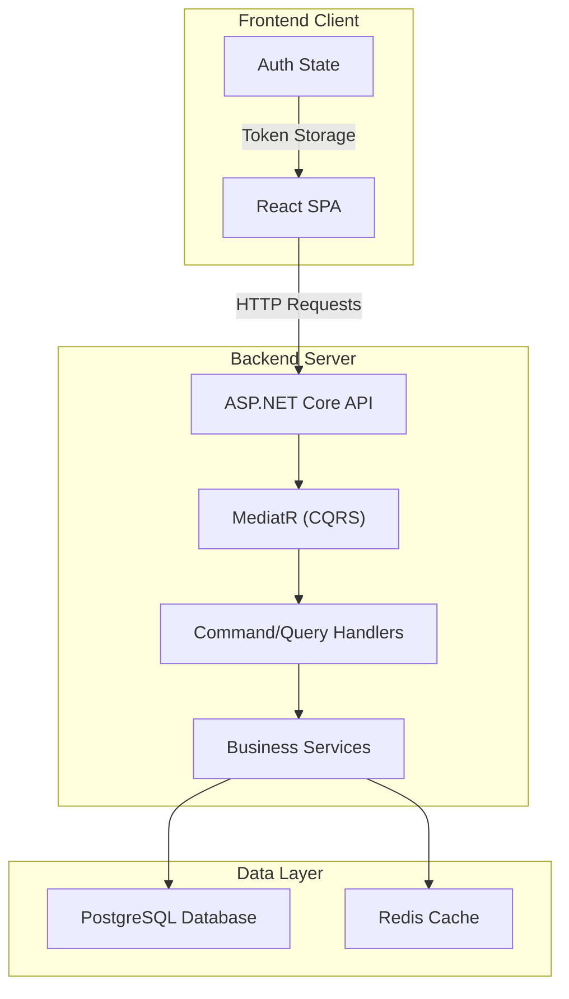
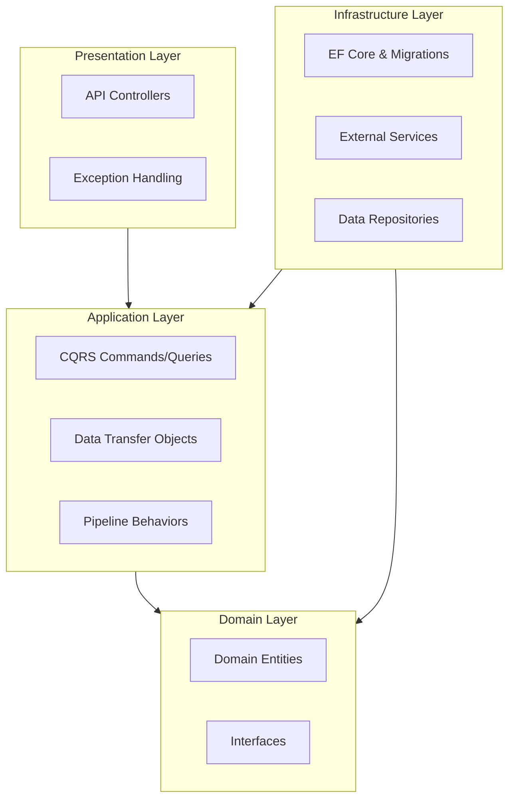
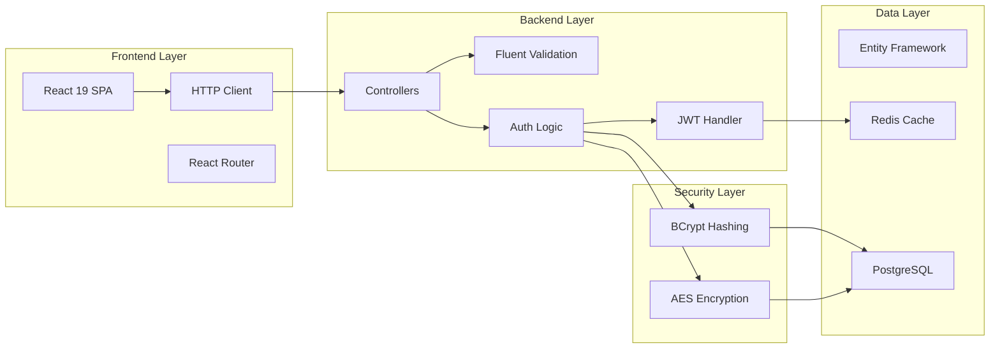
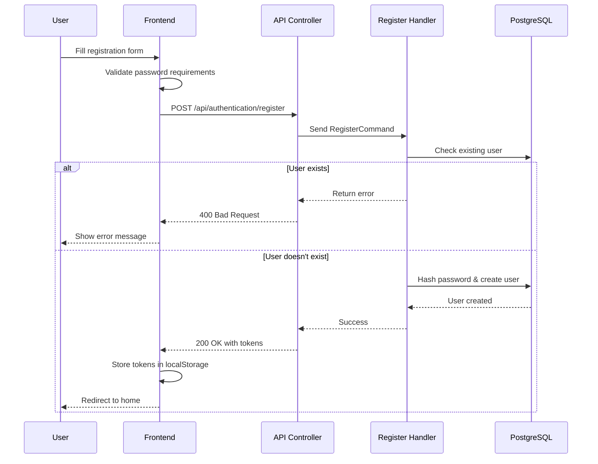
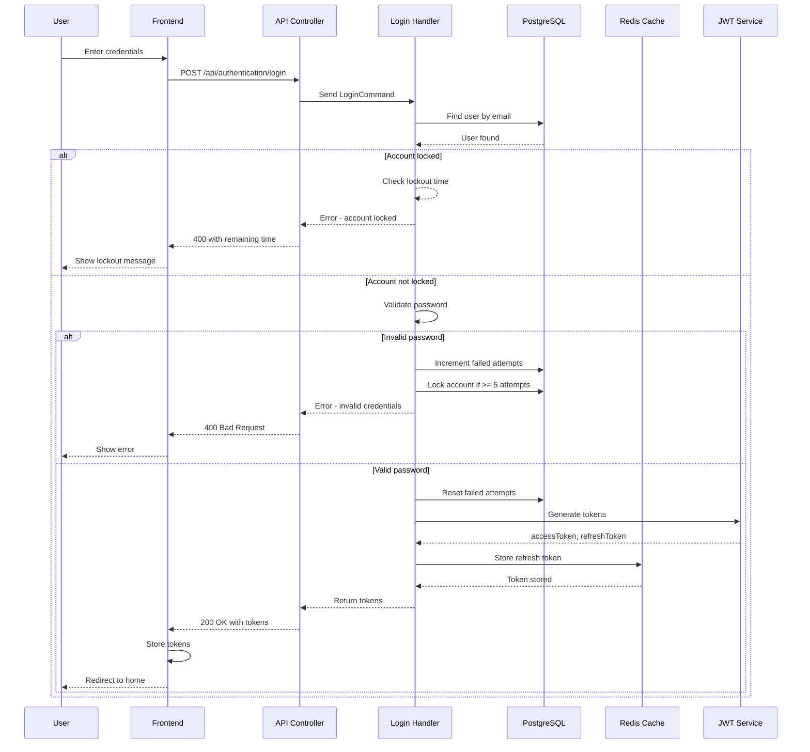
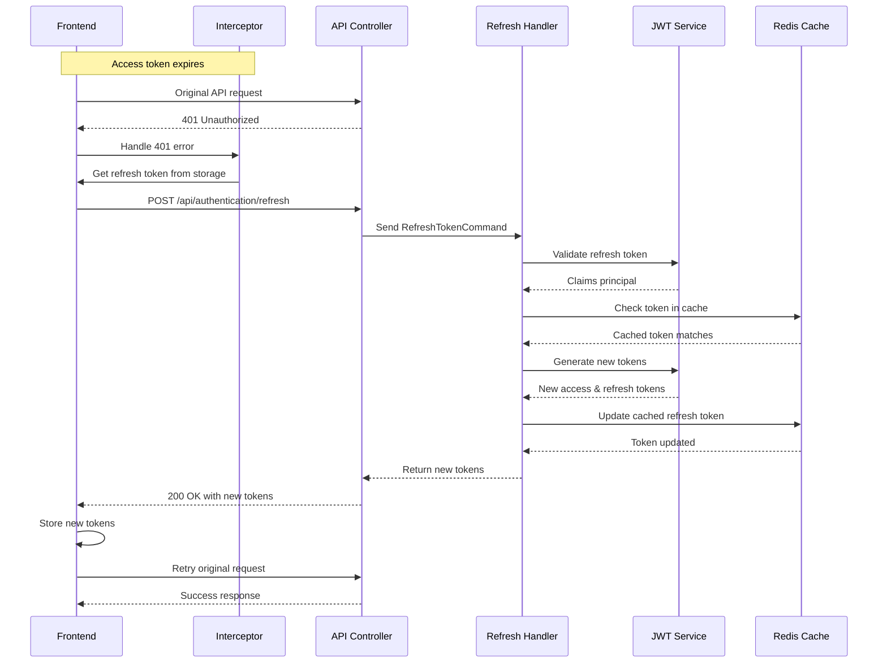
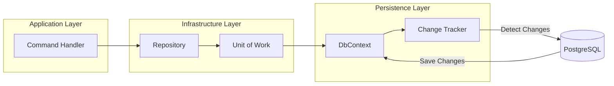

# Pharma Identity Service - Technical Documentation

**Date:** February 2026  
**Author:** Development Team

---

## Table of Contents

1. [Introduction](#1-introduction)
2. [Architecture Overview](#2-architecture-overview)
3. [Component Descriptions](#3-component-descriptions)
4. [Data Flow Explanations](#4-data-flow-explanations)
5. [Technology Stack](#5-technology-stack)
6. [API Reference](#6-api-reference)
7. [Security Considerations](#7-security-considerations)

---

## 1. Introduction

### 1.1 Purpose

This document provides comprehensive technical documentation for the Pharma Identity Service, an authentication and identity management system built with modern web technologies. The service implements secure user registration, login, and token management using industry best practices.

### 1.2 Scope

The Pharma Identity Service handles:
- User registration and authentication
- JWT-based session management
- Secure password storage
- Account lockout mechanisms
- Role-based access control

### 1.3 System Overview

The system is a client-server application consisting of:
- **Backend**: ASP.NET Core Web API (.NET 10)
- **Frontend**: React Single Page Application
- **Database**: PostgreSQL
- **Cache**: Redis

---

## 2. Architecture Overview

### 2.1 High-Level Architecture



### 2.2 Clean Architecture Layers



### 2.3 System Components



---

## 3. Component Descriptions

### 3.1 Frontend Components

#### 3.1.1 React Application (frontend/src/App.tsx)

**Purpose**: Main application entry point that handles routing and authentication state

**Key Responsibilities**:
- Initialize React Router for navigation
- Check authentication state on app load
- Redirect users based on auth status
- Protect routes requiring authentication

**Dependencies**: React Router DOM

**Key Code**:
```typescript
function App() {
  const isAuthenticated = localStorage.getItem(AUTH_STORAGE_KEYS.ACCESS_TOKEN);

  return (
    <BrowserRouter>
      <Routes>
        <Route path="/login" element={isAuthenticated ? <Navigate to="/home" /> : <Login />} />
        <Route path="/home" element={<ProtectedRoute><Home /></ProtectedRoute>} />
      </Routes>
    </BrowserRouter>
  );
}
```

#### 3.1.2 Login Page (frontend/src/pages/Login.tsx)

**Purpose**: User authentication interface

**Key Responsibilities**:
- Display login form with email and password fields
- Client-side validation
- Handle form submission
- Display error messages
- Store tokens on successful login

**State Management**:
```typescript
interface LoginFormData {
  email: string;
  password: string;
}
```

#### 3.1.3 Register Page (frontend/src/pages/Register.tsx)

**Purpose**: New user registration interface

**Key Responsibilities**:
- Display registration form
- Validate password requirements (min 12 chars, uppercase, special char)
- Confirm password matching
- Handle registration submission

#### 3.1.4 Protected Route (frontend/src/components/ProtectedRoute.tsx)

**Purpose**: Route guard for authenticated pages

**Key Responsibilities**:
- Check for valid access and refresh tokens
- Redirect unauthorized users to login
- Wrap protected child components

#### 3.1.5 HTTP Interceptors (frontend/src/api/interceptors/)

**Request Interceptor**:
- Automatically adds Authorization header with Bearer token
- Attaches JWT to every outgoing request

**Response Interceptor**:
- Catches 401 Unauthorized responses
- Attempts to refresh the access token
- Retries original request or redirects to login

### 3.2 Backend Components

#### 3.2.1 Authentication Controller (pharma-identity-service/Pharma.Identity.API/Controllers/AuthenticationController.cs)

**Purpose**: HTTP API endpoint handler

**Key Responsibilities**:
- Expose authentication endpoints
- Route requests to MediatR
- Return standardized responses

**Endpoints**:
```csharp
[HttpPost("register")]  // POST /api/authentication/register
[HttpPost("login")]      // POST /api/authentication/login
[HttpPost("refresh")]   // POST /api/authentication/refresh
```

#### 3.2.2 Login Command Handler (pharma-identity-service/Pharma.Identity.Application/Features/Authentication/Commands/Login.cs)

**Purpose**: Process user login requests

**Key Responsibilities**:
- Find user by email
- Check account lockout status
- Validate password
- Track failed login attempts
- Generate JWT tokens
- Store refresh token in Redis

**Security Features**:
- 5 failed attempts = 30-minute lockout
- Failed attempt counter reset on successful login

#### 3.2.3 Register Command Handler (pharma-identity-service/Pharma.Identity.Application/Features/Authentication/Commands/Register.cs)

**Purpose**: Create new user accounts

**Key Responsibilities**:
- Check for existing email
- Validate password strength
- Hash password using BCrypt
- Create user with default "Viewer" role

#### 3.2.4 Refresh Token Handler (pharma-identity-service/Pharma.Identity.Application/Features/Authentication/Commands/RefreshToken.cs)

**Purpose**: Generate new access tokens

**Key Responsibilities**:
- Validate refresh token signature
- Check token exists in Redis cache
- Calculate remaining TTL
- Generate new token pair
- Update Redis with new refresh token

#### 3.2.5 JWT Token Service (pharma-identity-service/Pharma.Identity.Infrastructure/Services/JwtTokenService.cs)

**Purpose**: JWT token generation and validation

**Key Responsibilities**:
- Generate access tokens (short-lived)
- Generate refresh tokens (long-lived)
- Validate refresh tokens
- Extract claims from tokens

**Token Configuration**:
```csharp
public string GenerateAccessToken(Ulid userId, string email)
{
    var claims = new[] {
        new Claim("userId", userId.ToString()),
        new Claim(ClaimTypes.Email, email),
        new Claim("tokenType", "access")
    };
    var expires = DateTime.UtcNow.AddMinutes(jwtTokenConfiguration.AccessTokenExpirationMinutes);
}
```

#### 3.2.6 Redis Caching Service (pharma-identity-service/Pharma.Identity.Infrastructure/Services/RedisCachingService.cs)

**Purpose**: Token caching and session management

**Key Responsibilities**:
- Store refresh tokens in Redis
- Retrieve cached tokens
- Set token expiration
- Remove tokens on logout

#### 3.2.7 Hasher Service (pharma-identity-service/Pharma.Identity.Infrastructure/Services/Hasher.cs)

**Purpose**: Secure password hashing

**Key Responsibilities**:
- Hash passwords using BCrypt
- Verify password matches hash

#### 3.2.8 User Repository (pharma-identity-service/Pharma.Identity.Infrastructure/Repositories/GenericRepository.cs)

**Purpose**: Database access layer for users

**Key Responsibilities**:
- CRUD operations for users
- Query by email
- Include related entities (Role)

### 3.3 Database Components

#### 3.3.1 User Entity (pharma-identity-service/Pharma.Identity.Domain/Entities/User.cs)

**Purpose**: Domain model for user data

**Fields**:
| Field | Type | Description |
|-------|------|-------------|
| UserId | Ulid | Primary key, unique identifier |
| Email | string | User email (unique) |
| Password | string | Hashed password |
| RoleId | int | Foreign key to Role |
| IsAccountLocked | bool | Account lock status |
| FailedLoginAttempts | int | Failed login counter |
| LastFailedLoginAt | DateTime? | Last failed attempt time |
| LockedUntil | DateTime? | Lockout expiration |

#### 3.3.2 Role Entity (pharma-identity-service/Pharma.Identity.Domain/Entities/Role.cs)

**Purpose**: Role definition for access control

**Fields**:
| Field | Type | Description |
|-------|------|-------------|
| RoleId | int | Primary key |
| Name | string | Role name (e.g., "Viewer") |

---

## 4. Data Flow Explanations

### 4.1 User Registration Flow



**Step-by-Step Explanation**:

1. User fills registration form with email, password, and confirm password
2. Frontend performs client-side validation (password length, complexity)
3. Frontend sends POST request to `/api/authentication/register`
4. API controller receives request and sends to MediatR
5. Register handler checks if user already exists
6. If user exists, return 400 error
7. If user doesn't exist, hash password using BCrypt
8. Create new user with default "Viewer" role
9. Return success with JWT tokens
10. Frontend stores tokens and redirects user

### 4.2 User Login Flow



**Step-by-Step Explanation**:

1. User enters email and password
2. Frontend sends POST request to `/api/authentication/login`
3. API controller routes to login handler via MediatR
4. Handler queries database for user by email
5. If user not found, return error
6. Check if account is locked:
   - If locked and lock time not expired, return lockout message
7. Validate password against stored hash
8. If invalid:
   - Increment failed attempts
   - Lock account if attempts >= 5
   - Return error
9. If valid:
   - Reset failed attempts counter
   - Generate access token (1 min expiry)
   - Generate refresh token (7 days expiry)
   - Store refresh token in Redis
   - Return both tokens to client
10. Frontend stores tokens in localStorage
11. Redirect user to home page

### 4.3 Token Refresh Flow



**Step-by-Step Explanation**:

1. Frontend makes API request with expired access token
2. API returns 401 Unauthorized
3. Axios interceptor catches 401 error
4. Interceptor retrieves refresh token from storage
5. Frontend calls `/api/authentication/refresh` endpoint
6. Refresh handler validates refresh token signature
7. Handler extracts claims (userId, email)
8. Handler checks Redis for cached refresh token
9. If tokens match:
   - Calculate remaining TTL
   - Generate new access token
   - Generate new refresh token with remaining TTL
   - Update Redis with new refresh token
   - Return new tokens to client
10. Frontend stores new tokens
11. Frontend retries original request with new access token

### 4.4 Data Persistence Flow



**Step-by-Step Explanation**:

1. Command handler receives business request
2. Handler calls repository methods
3. Repository delegates to Unit of Work
4. Unit of Work manages DbContext
5. DbContext tracks entity changes
6. On SaveChanges:
   - EF Core generates SQL
   - Changes committed to PostgreSQL
   - Auditable fields automatically updated

---

## 5. Technology Stack

### 5.1 Backend Technologies

| Category | Technology | Version | Purpose |
|----------|------------|---------|---------|
| Runtime | .NET | 10 | Application framework |
| API | ASP.NET Core | 10 | Web API framework |
| Database | PostgreSQL | 18 | Primary database |
| ORM | Entity Framework Core | 9.x | Object-relational mapping |
| CQRS | MediatR | 13.x | Message dispatching |
| Validation | FluentValidation | 11.x | Input validation |
| JWT | System.IdentityModel.Tokens.Jwt | 7.x | Token handling |
| Caching | Redis | 8.0.5 | Distributed caching |
| Logging | Microsoft.Extensions.Logging | - | Application logging |
| Containerization | Docker | - | Deployment |

### 5.2 Frontend Technologies

| Category | Technology | Version | Purpose |
|----------|------------|---------|---------|
| Framework | React | 19.2.0 | UI library |
| Language | TypeScript | 5.9 | Type-safe JavaScript |
| Build Tool | Vite | 7.2.4 | Development server & bundler |
| Routing | React Router | 7.13.0 | Client-side routing |
| HTTP Client | Axios | 1.13.4 | API requests |
| Styling | Tailwind CSS | 4.1.18 | Utility-first CSS |
| Linting | ESLint | 9.39.1 | Code quality |

### 5.3 Development Tools

| Tool | Purpose |
|------|---------|
| Docker Desktop | Container runtime |
| Visual Studio Code | Code editor |
| Git | Version control |
| Swagger/OpenAPI | API documentation |

---

## 6. API Reference

### 6.1 Authentication Endpoints

#### Register

```
POST /api/authentication/register
Content-Type: application/json

Request Body:
{
  "email": "user@example.com",
  "password": "SecurePass123!",
  "confirmPassword": "SecurePass123!"
}

Response (200 OK):
{
  "value": {
    "accessToken": "eyJhbGc...",
    "refreshToken": "eyJhbGc...",
    "userRole": "Viewer"
  },
  "isSuccess": true,
  "statusCode": 200,
  "errors": {}
}

Response (400 Bad Request):
{
  "value": null,
  "isSuccess": false,
  "statusCode": 400,
  "errors": {
    "message": "User with the given email already exists."
  }
}
```

#### Login

```
POST /api/authentication/login
Content-Type: application/json

Request Body:
{
  "email": "user@example.com",
  "password": "SecurePass123!"
}

Response (200 OK):
{
  "value": {
    "accessToken": "eyJhbGc...",
    "refreshToken": "eyJhbGc...",
    "userRole": "Viewer"
  },
  "isSuccess": true,
  "statusCode": 200,
  "errors": {}
}

Error Response (400 Bad Request):
{
  "value": null,
  "isSuccess": false,
  "statusCode": 400,
  "errors": {
    "message": "Invalid email or password"
  }
}
```

#### Refresh Token

```
POST /api/authentication/refresh
Content-Type: application/json

Request Body:
{
  "refreshToken": "eyJhbGc..."
}

Response (200 OK):
{
  "value": {
    "accessToken": "eyJhbGc...",
    "refreshToken": "eyJhbGc...",
    "userRole": null
  },
  "isSuccess": true,
  "statusCode": 200,
  "errors": {}
}
```

### 6.2 Health Check

#### Get Health Status

```
GET /api/health

Response:
Pharma Identity Service is healthy.
```

---

## 7. Security Considerations

### 7.1 Password Security

- **Hashing**: BCrypt with automatic salt generation
- **Minimum Requirements**: 12 characters, uppercase, special character
- **No Plain Text**: Passwords never stored in plain text

### 7.2 Token Security

- **Access Tokens**: Short-lived (1 minute)
- **Refresh Tokens**: Long-lived (7 days), stored in Redis
- **Token Rotation**: New refresh token on each refresh
- **No Clock Skew**: Zero tolerance for token expiration

### 7.3 Account Protection

- **Failed Attempts**: Maximum 5 attempts before lockout
- **Lockout Duration**: 30 minutes automatic unlock
- **Failed Tracking**: Timestamp and counter stored in database

### 7.4 Data Encryption

- **Sensitive Data**: AES-256 encryption for sensitive fields
- **Key Management**: Base64-encoded keys in configuration
- **IV Rotation**: Unique initialization vector per encryption

### 7.5 CORS Policy

- Development: Allow all origins, methods, headers
- Production: Should restrict to specific origins

---

## Appendix A: Database Schema

### Users Table

| Column | Type | Constraints | Description |
|--------|------|-------------|-------------|
| UserId | varchar(26) | PK, ULID | Unique identifier |
| Email | nvarchar(max) | Unique, Required | User email |
| Password | nvarchar(max) | Required | BCrypt hash |
| RoleId | int | FK | Role reference |
| IsAccountLocked | bit | Default: false | Lock status |
| FailedLoginAttempts | int | Default: 0 | Attempt counter |
| LastFailedLoginAt | datetimeoffset | Nullable | Last failure time |
| LockedUntil | datetimeoffset | Nullable | Lock expiration |
| CreatedAt | datetimeoffset | Required | Creation timestamp |
| UpdatedAt | datetimeoffset | Nullable | Last update |

### Roles Table

| Column | Type | Constraints | Description |
|--------|------|-------------|-------------|
| RoleId | int | PK | Unique identifier |
| Name | nvarchar(max) | Required | Role name |

---

## Appendix B: Configuration

### Required Environment Variables

| Variable | Description | Example |
|----------|-------------|---------|
| DB_CONNECTION_STRING | PostgreSQL connection | Host=localhost;Port=5432;Database=pharma-db |
| REDIS_CONNECTION_STRING | Redis connection | localhost:6379 |
| JWT_SECRET_KEY | Token signing key (min 32 chars) | YourSecretKey123... |
| JWT_ISSUER | Token issuer | Pharma.Identity |
| JWT_AUDIENCE | Token audience | Pharma.Clients |

---

*Document Version: 1.0*  
*Last Updated: February 2026*
